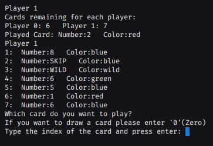

<div align = "center">

<h1><a href="https://2kabhishek.github.io/uno-plus">uno-plus</a></h1>

<a href="https://github.com/2KAbhishek/uno-plus/blob/main/LICENSE">
 </a>

<a href="https://github.com/2KAbhishek/uno-plus/graphs/contributors">
 </a>

<a href="https://github.com/2KAbhishek/uno-plus/stargazers">
</a>

<a href="https://github.com/2KAbhishek/uno-plus/network/members">
 </a>

<a href="https://github.com/2KAbhishek/uno-plus/watchers">
 </a>

<a href="https://github.com/2KAbhishek/uno-plus/pulse">
 </a>

<h3>Uno on the command line with C++ 🃏♣</h3>

<figure>
  
  <br/>
  <figcaption>uno-plus screenshot</figcaption>
</figure>

</div>

## What is this

Play the classic card game Uno on the terminal.

## Inspiration

Was reading about the [game rules](https://www.ultraboardgames.com/uno/game-rules.php), thought I'd make a CLI version.

## Prerequisites

Before you begin, ensure you have met the following requirements:

- You have installed the latest version of `make`, `g++`.

## Getting uno-plus

To install uno-plus, follow these steps:

```bash
git clone https://github.com/2kabhishek/uno-plus
cd uno-plus
make # Compile the game
./uno-plus # Run the game
```

## Using uno-plus

After starting the game it will show some instructions.
Follow the instructions and have fun!

## How it was built

uno-plus was built using `neovim`, `make` and `g++`.

## Challenges faced

Figuring out the architecture and the flow was a challenge.

## What I learned

- Learned about various C++ constructs and their uses.
- Learned about seperating `.h` and `.cpp` files.
- OOP with C++ revisited.
- Learnd the rules of the game.

## What's next

Planning to add colors and symbols someday.

Hit the ⭐ button if you found this useful.

## More Info

<div align="center">

<a href="https://github.com/2KAbhishek/uno-plus">Source</a> | <a href="https://2kabhishek.github.io/uno-plus">Website</a>

</div>
